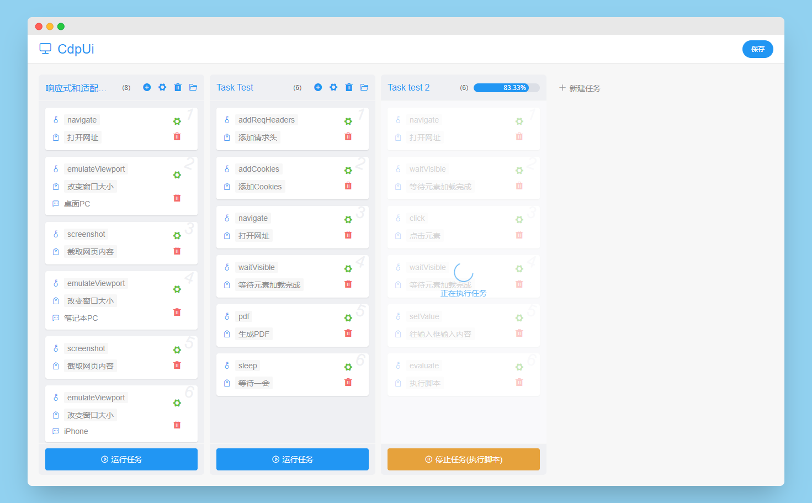

# Cdp_Ui

#### 介绍
CdpUI 是跨平台的，是一个使用 Golang 创建的本地实验性软件，可以构建一些子任务来控制浏览器做任何事情，
当然也可以通过少许改造变成一个 web 服务来供用户运行任务。

我希望 CdpUI 最终可以通过构建任务完成一些重复性的工作，例如：

- 前端页面的自动化测试和性能报告（例如测试网页在不同窗口大小下的响应和适配效果）
- 动态爬虫（任务依赖于浏览器渲染，理论上任何反爬虫措施都是无效的）
- 基于网页的重复性工作自动化（例如重复性的通过网页数据来整理你的文档和表格）
- ...

目前一些基本的工作已经完成，但是还有很多很棒的想法需要去完成。

- [x] pdf || 生成PDF
- [x] click || 点击元素
- [x] sleep || 等待一会
- [x] evaluate || 执行脚本
- [x] navigate || 打开网址
- [x] setValue || 往输入框输入内容
- [x] screenshot || 截取网页内容
- [x] addCookies || 添加Cookies
- [x] waitVisible || 等待元素加载完成
- [x] addReqHeaders || 添加请求头
- [x] emulateViewport || 改变窗口大小
- [x] captureScreenshot || 捕获屏幕
- [ ] collectDataByExcel || 通过表格搜集数据
- [ ] collectDataByWord || 通过文档搜集数据
- [ ] packageFile || 打包目前生成的所有文件
- [ ] ...

#### 运行原理

借助第三方库，运行此程序会尝试找到本地安装的 Chrome 并打开一个 Chrome 窗口，通过websocket连接到其dev-tools端点，
发送要加载的HTML，并提供Go和JS之间的通信。基于此，前端通过 vue3 vite vuex 等提供页面 UI 和交互，通过将构建的任务发送到 Golang。
此时， Golang 会创建 Chrome 实例上下文，使用 Chrome DevTools 协议驱动无头浏览器（默认情况下无UI，你也可以显示浏览器以便查看任务的运行过程）来运行你组建的任务。

#### 一些思考
通过表格搜集数据和通过文档搜集数据是什么呢？？
我在上一家公司曾经开发过一个功能，公司是一个集团子公司，按照集团要求，每个员工需要在一个月内学习一些东西并写出自己的读后感，
HR需要收集每个人的读后感并整理成规定的word文档（对word的段落文字颜色大小有严格的规定）上交，这对于HR无疑是一个不小的挑战。
后来我提出在公司的OA办公系统里加入此功能，员工登陆系统提交自己的读后感，通过PHP读取预设的word文档模板，使用正则替换，一篇篇漂亮的文档就被生成了。
因此，通过文档收集网页数据就是这种思路，由你做好文档模板，精心排版，不过关键的地方需要你使用诸如${#app > div.body > div.main  > div.paragraph }的符号表示,
那么在任务运行的过程中会将定位到的文字嵌入相应的地方，并且不会破坏你的文档格式。

虽然上面的这些功能最终都能被实现，但是对于自动化依旧有很大的局限性，除非给任务加入循环判断跳转的逻辑单元，否则它仅仅只能满足一部分场景，灵活度很有限。
但是，加入这些逻辑单元也会带来一些问题，比如一次运行任务可以简单将各种产生的文件生成，如果存在循环，那么文件名则需要处理以防止被覆盖等。